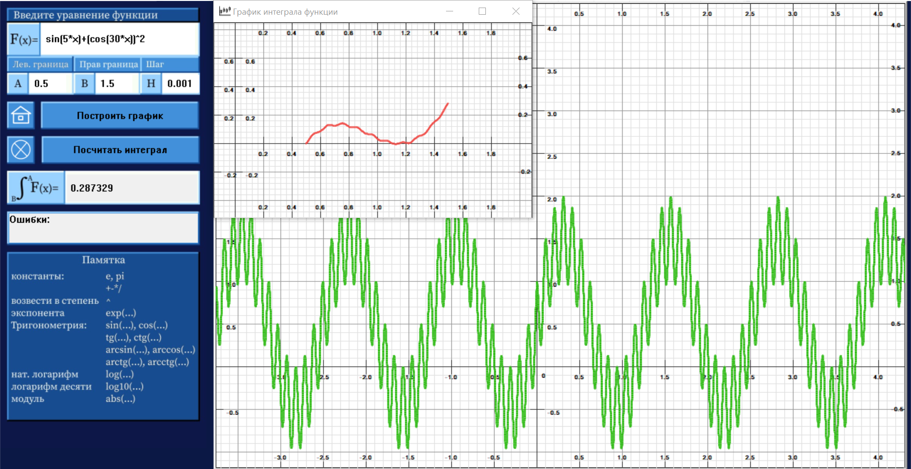

## "Интегратор"
Приложение написано с использованием языка c++ и WinAPI (и полным отсутствием знаний основ ООП)
Разработка завершена в мае 2024 года.
Функционал:
- построение графиков функций вещественной переменной (с ограниченной программой точностью)
- вычисление интеграла на заданном участке с заданной пользователем точностью
- построение участка графика интеграла заданной функции
### Нерешенные проблемы:
1. Экспоненциальный рост функции вырубает Приложение (нехватка познаний вычислительных методов)
2. Рефакторинг и оформление кода
3. Пользовательский интерфейс не настроен на привычную работу с клавиатурой
4. Вычисления через строки
5. Визуализация графика старомодна
6. Правильность работы приложения не подвергалась профессиональному тестированию и проверке правильности работы логики многих сочетаний функций

ZIP доступен для скачивания и запуска приложения через ярлык без необходимости сборки.
Функции для поиграть:
sin(2*x)+cos(30*x)^3+6
e^(-x)*sin(20*x)
sin(x)*cos(4*x)
sin(2*x)*1/sqrt(abs(x/140))-cos(3*x)
arctan(x)*cos(3*x)^3*abs(x/2)

